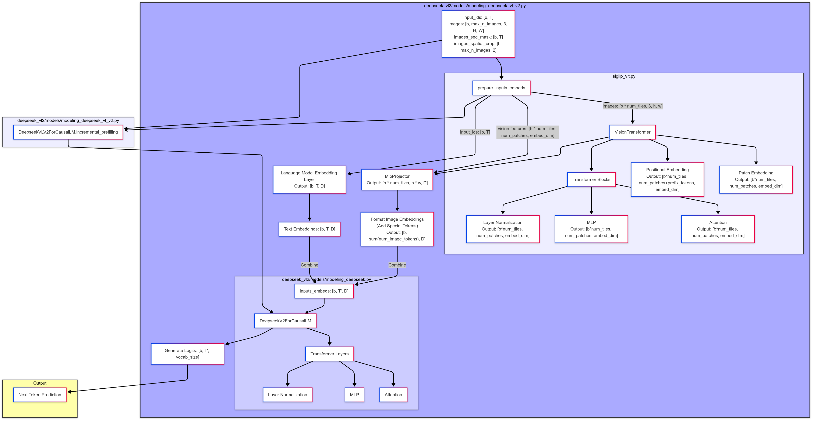

+++
title = 'DeepSeek-VL2'
date = 2024-01-14T07:07:07+01:00
draft = true
ShowToc = false
TocOpen = false
+++

- `b`: Batch size
- `T`: Original text sequence length
- `T'`: Text sequence length + image tokens
- `max_n_images`: Maximum number of images
- `H, W`: Original image height/width
- `h, w`: Cropped image height/width
- `num_patches`: Number of patches (Vision Encoder)
- `embed_dim`: Vision Encoder embedding dimension
- `D`: Language model embedding dimension
- `num_tiles`: Total number of image tiles
- `prefix_tokens`: Number of class tokens

### VLM Architecture

Let's break down the full autoregressive workflow of DeepSeek-VL2, step-by-step, in words. This will cover both the initial processing of the prompt (which can be optimized with incremental prefilling) and the subsequent token-by-token generation.

**I. Prompt Processing (Prefilling)**

This phase prepares the model to start generating text. It takes the user's input (text and optionally images) and converts it into a form the model can understand.

1.  **User Input:** The user provides:
    *   Text input (a question, a description, etc.).
    *   Optionally, one or more images.

2.  **Preprocessing (DeepseekVLV2Processor):**
    *   **Text Tokenization:** The input text is split into tokens (words or sub-words) using the tokenizer. Each token is converted into a numerical ID.
    *   **Image Processing:** If images are present:
        *   The processor identifies occurrences of the special `<image>` token in the text.
        *   Each image is potentially resized and cropped into multiple views:
            *   A "global" view (the entire image, padded to a standard size).
            *   Several "local" views (smaller, overlapping crops).
        *   Each view is transformed into a tensor (numerical representation of pixel values) and normalized.
        *   A sequence of special image tokens (`<image>`) is created. The number of these tokens corresponds to the global view and the local views.
        * A `images_seq_mask` is generated to represent the location of the image tokens.
        * `image_spatial_crop` records how to crop images.
    *   **Combined Token Sequence:** The tokenized text and the image tokens are combined into a single sequence of IDs. The `<image>` tokens in the text are placeholders that will be replaced by the image embeddings later.

3.  **Embedding Preparation (DeepseekVLV2ForCausalLM.prepare_inputs_embeds):** This step creates the actual input embeddings for the language model.
    *   **Text Embeddings:** The token IDs for the text are converted into embedding vectors using the language model's embedding layer. This results in a tensor of shape `[batch_size, text_seq_len, embedding_dim]`.
    *   **Image Embeddings:** If images are present:
        *   The processed image views (global and local) are passed through the `VisionTransformer` (SigLIP ViT). This produces a sequence of visual features for each view.
        *   The visual features are then passed through the `MlpProjector`, which projects them into the same embedding space as the text embeddings.
        *   Special tokens (like newline characters and view separators) are added to the sequence of image embeddings to help the model understand the spatial relationships between the image patches.
        *   The image embeddings are then *inserted* into the text embedding sequence, replacing the `<image>` placeholder tokens. This uses the `masked_scatter_` operation, guided by the `images_seq_mask`.
    *   **Combined Embeddings:** The result is a single tensor, `inputs_embeds`, of shape `[batch_size, total_seq_len, embedding_dim]`, where `total_seq_len` is the combined length of the text tokens and the image tokens.

4.  **Incremental Prefilling (DeepseekVLV2ForCausalLM.incremental_prefilling) - OPTIONAL, but highly recommended:**
    *   This is an optimization step. Instead of processing the entire `inputs_embeds` tensor at once, it processes it in chunks.
    *   For each chunk:
        *   A forward pass is performed through the *entire* language model (all Transformer layers).
        *   The key-value pairs (from the self-attention mechanism in each Transformer layer) are *cached*.
    *   The cached key-value pairs (`past_key_values`) and the `inputs_embeds` are returned.

**II. Autoregressive Generation (Token-by-Token)**

This phase generates the text output, one token at a time.

1.  **Initial Input:**
    *   If `incremental_prefilling` was used, the input to the generation loop is:
        *   The `inputs_embeds` (but now only including the *last* token, the rest represented by cache).
        *   The cached `past_key_values` from prefilling.
    *   If `incremental_prefilling` was *not* used, the input is the full `inputs_embeds` tensor (and `past_key_values` is initially `None`).

2.  **Forward Pass (DeepseekVLV2ForCausalLM.forward within generate):** The language model performs a forward pass:
    *   The `inputs_embeds` (representing either the last token or the full sequence, depending on whether prefilling was used) and the `past_key_values` (if available) are passed to the language model.
    *   The Transformer layers process the input, using the cached key-value pairs to avoid redundant calculations.
    *   The output of the final Transformer layer is passed through a Layer Normalization.
    *   The result is a tensor of logits, of shape `[batch_size, 1, vocab_size]` (if caching is used) or `[batch_size, sequence_length, vocab_size]` (if no caching). These logits represent the model's predicted probability distribution over the vocabulary for the *next* token.

3.  **Sampling:**
    *   The logits are used to sample the next token. This sampling can be done in various ways (greedy decoding, top-k sampling, nucleus sampling, etc.), controlled by parameters like `temperature` and `top_p`.
    *   The sampled token is represented by its ID.

4.  **Update:**
    *   The new token ID is appended to the sequence.
    *   The key-value pairs calculated in the current forward pass are added to the `past_key_values` cache (or replace the existing cache if not using incremental prefilling).

5.  **Decoding:** The generated token ID is converted back into text (a word or sub-word) using the tokenizer.

6.  **Iteration:** Steps 2-5 are repeated until a stopping criterion is met:
    *   A special end-of-sequence (EOS) token is generated.
    *   A maximum sequence length is reached.
    *   A stop word is generated.

7.  **Output:** The decoded text is the model's response.

**In Summary:**

The autoregressive process is a loop.  Each iteration, the model takes the *current* sequence (either the initial prompt or the prompt plus previously generated tokens), processes it (using caching to avoid redundancy), predicts the *next* token, and adds that token to the sequence. This continues until the model decides to stop. The "autoregressive" part means that each new token depends on all the tokens that came before it. The "prefilling" stage is just an optimized way of processing the initial prompt. The Vision Encoder and Projector are used *only* during the prompt processing stage to incorporate image information. Once the image embeddings are inserted into the `inputs_embeds`, the rest of the process is handled by the language model.

