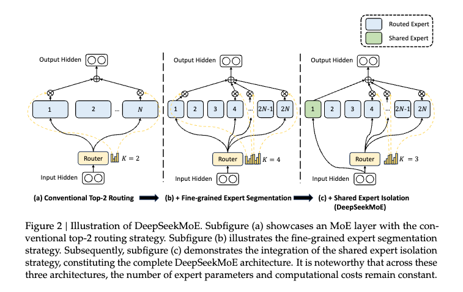

+++
title = 'Toy Diffusion Model'
date = 2024-12-14T07:07:07+01:00
draft = true
+++


# Table of Contents
1. [Introduction](#introduction)
2. [Model Architecture](#model-architecture)
3. [Inference](#inference)
4. [Conclusion](#conclusion)


# Introduction


DeepSeek has quickly become a household name after their release of DeepSeek-R1 model which caused dramatic sell off of NVIDIA stock, causing its value to drop by roughly 17% in one trading session, erasing $593 billion in market value, a record one-day loss for any company on Wall Street ([Reuters](https://www.reuters.com/technology/chinas-deepseek-sets-off-ai-market-rout-2025-01-27/)). 


The intended audience of this post is someone who has a solid understanding of Deep Learning and GPT2. 

My favorite guides to GPT2: 
- Andrej Karpathy's nanoGPT https://youtu.be/l8pRSuU81PU?si=CJfTSaAWVYtBSYkM
- ARENA - https://arena-chapter1-transformer-interp.streamlit.app/[1.1]_Transformer_from_Scratch
- Neel Nanda's Transformer Walkthrough Youtube series ([part1](https://youtu.be/bOYE6E8JrtU?si=CPbjtpRWJ0xji3t9)/[part2](https://youtu.be/dsjUDacBw8o?si=ZWT0X_irEqgUH423)) - 
- https://jalammar.github.io/illustrated-transformer/ (very satisfying visual explanations)


# Positional Embeddings

## Rotary Positional Embeddings

GPT-2 used learned absolute positional embeddings, which are very simple to implement, but fail to generalize since they do not encode particularly meaningful information. For example, when humans read text, do we care to if *this* word is the 8256th exact word in the text? Or do we care about its relationship to the words around it? The absolute position rarely matters for the meaning - what matters is how words relate to each other. On the other hand, many relative positional embeddings, such as the one used in T5, require maintaining explicit $N\times N$ relative position matrices which are very expensive. 

Additionally, GPT-2's positional embeddings, the model would generate a separate positional embeddings vector and **add** it with our token embeddings. By summing two vectors, we are **polluting** the semantic information with positional information. Instead, we need a way to encoding the positional information without affecting interference with the token embeddings. We can do this by switching from **adding** to **multiplying**. 

**Rotary Positional Embeddings (RoPE)** aims to solve these issues with a principled, easy to implement, and generally-applicable method for relative embedding method. 

First, let's review how the attention layers use positional embeddings to pass information between tokens:

$$\text{Attention}(Q, K, V) = \text{softmax}\left(\frac{QK^T}{\sqrt{d_k}}\right)V$$

In the attention layer, the input is projected into $Q$, $K$, and $V$ vectors. The amount of influence one token has to another token is determined by the $QK^T$ dot product. The $QK$ circuit shown above in purple represents one circuit from the $QK^T$ dot product.  


The formula for dot product can be represented as: 

$$\vec{a} \cdot \vec{b} = |\vec{a}||\vec{b}|\cos(\theta)$$

The key insight the formula reveals is that we can change the result of the dot product by rotating the vectors. 


```python
def precompute_freqs_cis(args: ModelArgs) -> torch.Tensor:
    """
    Precomputes frequency-based complex exponential values for rotary positional embeddings.

    Args:
        args (ModelArgs): Model arguments containing positional embedding parameters.

    Returns:
        torch.Tensor: Precomputed complex exponential values for positional embeddings.
    """
    dim = args.qk_rope_head_dim
    seqlen = args.max_seq_len
    base = args.rope_theta

    freqs = 1.0 / (base ** (torch.arange(0, dim, 2, dtype=torch.float32) / dim)) # (dim // 2,)

    t = torch.arange(seqlen) # (seqlen,)
    freqs = torch.outer(t, freqs) # (seqlen, dim // 2)
    freqs_cis = torch.polar(torch.ones_like(freqs), freqs) # (seqlen, dim // 2)
    return freqs_cis


```

References:
- https://blog.eleuther.ai/rotary-embeddings/
- https://fleetwood.dev/posts/you-could-have-designed-SOTA-positional-encoding

## Yarn

https://arxiv.org/pdf/2309.00071

# RMS Norm


# MLA (Multi-Head Latent Attention)

Since the Multi-Head Attention was first introduced in "Attention is All You Need" in 2017, it has prove to be a general purpose architecture that is expressive (in the forward pass), optimizable (via backpropogation and gradient descent), and efficient (high parallelism compute graph) ([See Karpathy Tweet](https://x.com/karpathy/status/1582807367988654081)), while remaining largely the same as when it was first released. However, one of the main issues with Multi-Head Attention that remains is that generations for long sequence lengths become memory bound by the Key-Value (KV) cache which limits inference efficiency.


<details>

<summary>Recap: What is the Key-Value (KV) cache?</summary>


LLMs generate text one token at a time, in a process called autoregressive generation. The output at each step becomes part of the input for the next step. Every time the model generates a new token, it re-calculates values from previous iterations which is extremely wasteful, especially for longer context lengths. The biggest bottleneck for long context is the attention mechanism because the cost of its pairwise comparisons between tokens scale quadratically $O(n^2)$ with sequence length. The KV cache address this issue by caching Keys and Values from previous iterations. 


---
</details>


Multi-Head Latent Attention (MLA) was one of the major breakthroughs made by DeepSeek, first introduced in the [DeepSeek-V2](https://arxiv.org/pdf/2405.04434) paper. This novel attention implementation was designed to drastically cut down on the memory, the main bottleneck in the transformer architecture, by reducing the size of the KV cache. Other methods have also been tried such as Multi-Query Attention (MQA) and Grouped-Query Attention (GQA), but have not shown strong performance. 


# DeepSeekMoE

DeepSeek's Mixture of Experts (MoE) architecture known as [**DeepSeekMoE**](https://arxiv.org/pdf/2401.06066) replaces the traditional dense MLP layers, like the ones used in GPT-2. The idea of the MoE architecture is to compose a **system of separate expert networks** that are each responsible for handling a different region of the input space, and then using a **gating network** to determine which experts to activate and to weigh the contributions of each of the activated experts to the final output. 

Compared to dense MLP/Feed-Forward layers, sparse MoE layers are beneficial for several key reasons:
1. **Computational Efficiency** - MoE models can achieve better performance while drastically reducing computational cost at inference by only activating a subset of their parameters instead of all of the parameters. 
2. **Specialization and Modularity** - Expert Networks become specialized for different types of inputs or tasks which allows models to develop deep competences in multiple domains without experts interfering with each other's learning.
3. **Scaling Benefits** - Compute scales with the number of active parameters, not total parameters. Therefore, MoE layers allow models to scale to much larger parameter counts without proportionally increasing compute costs. 


While there were open source LLMs that used the MoE architecture, such as in Mixtral's [Mixture of Experts](https://arxiv.org/pdf/2401.04088), most of the frontier open source models were based around Llama (up to Llama 3.2 as of DeepSeek-V3's release) and still used dense MLP/Feed-Forward layers. DeepSeek-V3 made key innovations that addressed common issues in traditional MoE architectures such as routing instability and collapse, load imbalance, communication overhead, etc.

<p align="center">
  
</p>
<p align="center"><em>Figure 1: DeepSeekMoE Architecture Overview</em></p>


## Fine-Grained Experts

When there are only a limited/small number of experts, each expert needs to cover a wide range of knowledge with many diverse concepts. As a result, each expert holds vastly different types of knowledge, which makes it difficult to cleanly select the best experts to use for each token. However, if we had a large number of experts, knowledge could be better decomposed, leading to a more focused knowledge distribution across experts. 

DeepSeekMoE addresses this issue with **Fine-Grained** experts which enable more flexible and adaptable complication of activated experts. For example, as shown in the figure above, 


## Shared Experts

In conventional Mixture of Experts architectures (shown above as `Subfigure (a)`), experts may need to learn some common knowledge or information. This means that many experts are likely to converge in storing shared knowledge in their parameters, resulting in redundancies. Shared experts (shown above as `Subfigure (c)`) address this problem by dedicating a subset of experts to always activated, regardless of the router module. 

## Auxiliary-Loss-Free Load Balancing

Mixture of Experts models are much harder to train compared to conventional dense MLP/FeedForward model because of the extra complexity of load balancing experts. An unbalanced expert load leads to routing collapse (when a small subset of experts handles a disproportionately large amount of the workload) which results in underutilized parameters, limiting model diversity and capability. Common solutions rely on the use of an auxiliary loss (an additional loss function added to the primary loss function) to avoid an unbalanced load of experts. However, this approach hurts model performance by conflicting with the primary next token prediction loss function and hyperparameter sensitivity of the auxiliary loss weighting factor hyperparameter. 

Instead, DeepSeek-V3 pioneers an auxiliary-loss-free load balancing strategy to ensure load balancing by introducing a bias term $b_i$ for each expert. This bias term is added to the the original affinity scores $s_{i,t}$ which is used in top-$K$ routing:

$$
\begin{align}
    g^{\prime}_{i,t} & = \begin{cases} 
    s_{i,t}, & s_{i,t} + b_i \in \operatorname{Topk} (\{ s_{j, t} + b_j | 1 \leq j \leq N_r \}, K_{r}), \\
    0, & \text{otherwise}.
    \end{cases}
\end{align}
$$

where:
- $g^{\prime}_{i,t}$ is the routing weight for expert $i$ and token $t$
- $s_{i,t}$ is the raw routing for expert $i$ and token $t$
- $b_i$ is the bias term for expert $i$ used for load balancing
- $N_r$ is the total number of routed experts (256 in the 671B model)
- $K_r$ is the number of experts to activate per token (8 in the 671B model)


### Full Equation

The output of an MoE layer can be expressed as:
$$
\begin{align}
    \mathbf{h}_{t}^{\prime} & = \mathbf{u}_{t} + \sum_{i=1}^{N_{s}} {\operatorname{FFN}^{(s)}_{i}\left( \mathbf{u}_{t} \right)} + \sum_{i=1}^{N_r} {g_{i,t} \operatorname{FFN}^{(r)}_{i}\left( \mathbf{u}_{t} \right)}, \\
    g_{i,t} & = \frac{g^{\prime}_{i,t}}{\sum_{j=1}^{N_r} g^{\prime}_{j,t}}, \\
        g^{\prime}_{i,t} & = \begin{cases} 
    s_{i,t}, & s_{i,t} + b_i \in \operatorname{Topk} (\{ s_{j, t} + b_j | 1 \leq j \leq N_r \}, K_{r}), \\
    0, & \text{otherwise}.
    \end{cases} \\
    s_{i,t} & = \operatorname{Sigmoid} \left( {\mathbf{u}_{t}}^{T} \mathbf{e}_{i} \right),
\end{align}
$$

where:
- $\mathbf{h}_{t}^{\prime}$ is the output of the MoE layer for token $t$
- $\mathbf{u}_{t}$ is the normalized residual stream for token $t$
- $\operatorname{FFN}^{(s)}_{i}$ is the $i$-th shared expert feed-forward network
- $\operatorname{FFN}^{(r)}_{i}$ is the $i$-th router expert feed-forward network
- $N_r$ is the number of routed experts (256 in the 671B model)
- $g_{i,t}$ is the normalized routing weight for expert $i$ and token $t$
- $g^{\prime}_{i,t}$ is the unnormalized routing weight, only non-zero for top-k experts
- $K_r$ is the number of activated experts per token (8 in the 671B model)
- $s_{i,t}$ is the raw routing score from the sigmoid gate
- $\mathbf{e}_{i}$ is the learned routing parameters for expert $i$

## Node-Limiting Routing

## Implementation 

```python
class Gate(nn.Module):
    """
    Gating mechanism for routing inputs in a mixture-of-experts (MoE) model.

    Attributes:
        dim (int): Dimensionality of input features.
        topk (int): Number of top experts activated for each input.
        n_groups (int): Number of groups for routing.
        topk_groups (int): Number of groups to route inputs to.
        route_scale (float): Scaling factor for routing weights.
        weight (torch.nn.Parameter): Learnable weights for the gate.
        bias (torch.nn.Parameter): Optional bias term for the gate.
    """
    def __init__(self, args: ModelArgs):
        """
        Initializes the Gate module.

        Args:
            args (ModelArgs): Model arguments containing gating parameters.
        """
        super().__init__()
        # (--- Hyperparameter ---)#
        self.dim = args.dim # 7168 
        self.topk = args.n_activated_experts # 8
        self.n_groups = args.n_expert_groups # 8
        self.topk_groups = args.n_limited_groups # 4
        self.route_scale = args.route_scale # 2.5

        # (--- Routing Parameters ---)#
        self.weight = nn.Parameter(torch.empty(args.n_routed_experts, args.dim)) # (256, 7168)
        self.bias = nn.Parameter(torch.empty(args.n_routed_experts)) # (256)

    def forward(self, x: torch.Tensor) -> Tuple[torch.Tensor, torch.Tensor]:
        """
        Forward pass for the gating mechanism.

        Args:
            x (torch.Tensor): Input tensor.

        Returns:
            Tuple[torch.Tensor, torch.Tensor]: Routing weights and selected expert indices.
        """
        # (--- 1. Compute routing scores ---)#
        # (batch_size * seq_len, n_dim) @ (n_dim, n_routed_experts) = (batch_size * seq_len, n_routed_experts)
        scores = linear(x, self.weight) #  (batch_size * seq_len, 256 routed experts)

        # Apply sigmoid score function and add bias term
        scores = scores.sigmoid()
        original_scores = scores
        scores = scores + self.bias

        #(--- 2. Mask scores not in top k groups ---)#
        # Reshape into groups 
        # (batch_size * seq_len, n_groups, n_routed_experts)
        # (batch_size * seq_len, 8 GPU nodes, 32 experts)
        scores = scores.view(x.size(0), self.n_groups, -1) 

        # (batch_size * seq_len, n_groups); (batch_size * seq_len, 8 groups)
        group_scores = scores.topk(2, dim=-1)[0].sum(dim=-1) # sum of top 2 scores from each group 

        # Select indices of top k GPU nodes (4 nodes)
        indices = group_scores.topk(self.topk_groups, dim=-1)[1] #(batch_size * seq_len, 4 groups)

        # Apply mask to keep only experts from selected nodes
        mask = torch.zeros_like(scores[..., 0]).scatter_(1, indices, True)
        scores = (scores * mask.unsqueeze(-1)).flatten(1) # (batch_size * seq_len, 256 routed experts)

        # Select indices of top k experts (8 experts)
        indices = torch.topk(scores, self.topk, dim=-1)[1] # (batch_size * seq_len, 8 experts)

        # Gather routing weights for top k experts (8 experts)
        weights = original_scores.gather(1, indices) # (batch_size * seq_len, 8 experts)

        # Normalize routing weights for larger models
        weights /= weights.sum(dim=-1, keepdim=True)

        # Scale routing weights by route_scale
        weights *= self.route_scale # (batch_size * seq_len, 8 experts)

        return weights.type_as(x), indices


class MoE(nn.Module):
    """
    Mixture-of-Experts (MoE) module.

    Attributes:
        dim (int): Dimensionality of input features.
        n_routed_experts (int): Total number of experts in the model.
        n_local_experts (int): Number of experts handled locally in distributed systems.
        n_activated_experts (int): Number of experts activated for each input.
        gate (nn.Module): Gating mechanism to route inputs to experts.
        experts (nn.ModuleList): List of expert modules.
        shared_experts (nn.Module): Shared experts applied to all inputs.
    """
    def __init__(self, args: ModelArgs):
        """
        Initializes the MoE module.

        Args:
            args (ModelArgs): Model arguments containing MoE parameters.
        """
        super().__init__()
        # (--- Model Dimensions ---)#
        self.dim = args.dim

        assert args.n_routed_experts % world_size == 0
        self.n_routed_experts = args.n_routed_experts # 256
        self.n_local_experts = args.n_routed_experts // world_size
        self.n_activated_experts = args.n_activated_experts # 8
        self.experts_start_idx = rank * self.n_local_experts
        self.experts_end_idx = self.experts_start_idx + self.n_local_experts

        # (--- Routing Gate ---)#
        self.gate = Gate(args)

        # (--- Routed and Shared Experts ---)#
        self.experts = nn.ModuleList([Expert(args.dim, args.moe_inter_dim) if self.experts_start_idx <= i < self.experts_end_idx else None
                                      for i in range(self.n_routed_experts)])
        self.shared_experts = MLP(args.dim, args.n_shared_experts * args.moe_inter_dim)

    def forward(self, x: torch.Tensor) -> torch.Tensor:
        """
        Forward pass for the MoE module.

        Args:
            x (torch.Tensor): Input tensor.

        Returns:
            torch.Tensor: Output tensor after expert routing and computation.
        """
        shape = x.size()
        x = x.view(-1, self.dim) # Flatten input tensor to (batch_size * seq_len, n_dim)

        #(--- 1. Gate ---)#     
        weights, indices = self.gate(x) # (batch_size * seq_len, 8 experts), (batch_size * seq_len, 8 experts)

        #(--- 2. Apply Experts ---)#
        y = torch.zeros_like(x) # (batch_size * seq_len, n_dim)

        # Count how many tokens selected each expert (e.g., for 671B model with 256 routed experts,
        # returns a list of 256 integers where counts[i] = number of tokens that selected expert i)
        # (batch_size * seq_len, 256 routed experts)
        counts = torch.bincount(indices.flatten(), minlength=self.n_routed_experts).tolist()

        for i in range(self.experts_start_idx, self.experts_end_idx): # model parallelism
            # Skip experts not within top k experts
            if counts[i] == 0: 
                continue

            expert = self.experts[i]
            idx, top = torch.where(indices == i)
            
            y[idx] += expert(x[idx]) * weights[idx, top, None]

        #(--- 3. Apply Shared Experts ---)#
        z = self.shared_experts(x)

        #(--- 4. Gather Results from All GPUs ---)#
        if world_size > 1:
            dist.all_reduce(y)

        # (--- 5. Sum results from routed experts and shared experts and reshape back to residual stream dimension ---)#
        return (y + z).view(shape) 
```        


### Complementary Sequence-Wise Auxiliary Loss 

$$
\begin{align}
    \mathcal{L}_{\mathrm{Bal}} & = \alpha \sum_{i=1}^{N_r}{f_i P_i}, \\
    f_i = \frac{N_r}{K_r T} \sum_{t=1}^{T} \mathbb{1} & \left( s_{i,t} \in \operatorname{Topk} ( \{ s_{j, t} | 1 \leq j \leq N_r \}, K_{r} ) \right), \\
    s^{\prime}_{i,t} & = \frac{s_{i,t}}{\sum_{j=1}^{N_r} s_{j,t}}, \\
    P_i & = \frac{1}{T} \sum_{t=1}^{T}{s^{\prime}_{i,t}},
\end{align}
$$

In DeepSeek-V3's full 671B parameter model, each MoE layer has a total of 256 expert, but only 8 of the experts are activated per token. 


## Node-Limited Routing

Ensure that each token will be sent to at most M nodes, which are selected according to the sum of the highest activated experts / total 


## Gate Implementation


## Mixture of Experts Implementation 

Links
- https://huggingface.co/blog/moe#making-moes-go-brrr


## Gate


## Parallelization

## FP8 Training

## DeepSeekMoE Inference


# Model Parallelism

# Quantization